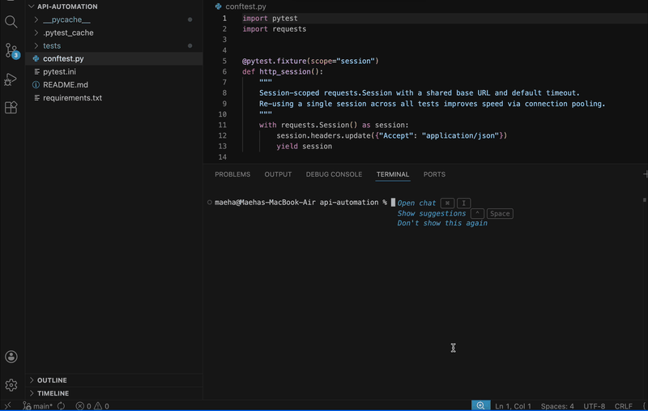

# API Automation — JSONPlaceholder

Automated API tests for **[JSONPlaceholder](https://jsonplaceholder.typicode.com)** — a free, public REST API that provides fake data for posts, comments, users, todos, albums, and photos.

**Why JSONPlaceholder?**
- No API key or account required
- Reliably available (suitable for CI/CD)
- Supports full CRUD (GET / POST / PUT / DELETE)
- Returns predictable, schema-stable JSON
- Listed in [public-apis/public-apis](https://github.com/public-apis/public-apis)

---
## Project Structure

```
api-automation/
├── conftest.py                    # Shared fixtures (requests.Session, base URL)
├── pytest.ini                     # pytest configuration
├── requirements.txt               # Python dependencies
└── tests/
    └── test_jsonplaceholder.py    # All test cases
```

---
## Test Cases

| ID | Class | Method | Description | Validation Used | Why |
|----|-------|--------|-------------|-----------------|-----|
| TC-01a | `TestGetAllPosts` | `test_status_and_content_type` | GET /posts returns HTTP 200 and `Content-Type: application/json` | Status code + header value | Confirms the endpoint is healthy and serving JSON |
| TC-01b | `TestGetAllPosts` | `test_returns_100_posts` | GET /posts returns exactly 100 items | `len(list) == 100` | Detects truncated or duplicated collections |
| TC-01c | `TestGetAllPosts` | `test_all_posts_have_valid_schema` | Every post has `userId`, `id`, `title`, `body` with correct types | Schema assertion on each item | Catches field renames or type changes that break consumers |
| TC-02a | `TestGetSinglePost` | `test_valid_post_id_returns_200` *(×3)* | GET /posts/1, /50, /100 each return 200 | Status code | Boundary + mid-range parametrisation over valid IDs |
| TC-02b | `TestGetSinglePost` | `test_returned_id_matches_requested_id` *(×3)* | Echoed `id` equals the requested ID | `post["id"] == post_id` | Detects routing bugs where wrong record is returned |
| TC-02c | `TestGetSinglePost` | `test_single_post_schema` *(×3)* | Individual post conforms to schema | Schema assertion | Ensures schema is consistent on single-resource vs collection endpoint |
| TC-03a | `TestGetInvalidPost` | `test_invalid_post_id_returns_404` *(×3)* | GET /posts/0, /-1, /9999 each return 404 | Status code | Confirms proper error handling for non-existent resources |
| TC-03b | `TestGetInvalidPost` | `test_invalid_post_returns_empty_object` *(×3)* | 404 body is an empty JSON object `{}` | `body == {}` | Validates the API contract — empty object, not null or HTML error page |
| TC-04a | `TestCreatePost` | `test_create_post_returns_201` | POST /posts returns 201 Created | Status code | Confirms correct HTTP semantics for resource creation |
| TC-04b | `TestCreatePost` | `test_create_post_response_contains_payload_fields` | Response echoes back `title`, `body`, `userId` | Field equality | Ensures the server accepted and stored the submitted values |
| TC-04c | `TestCreatePost` | `test_create_post_response_has_new_id` | Response contains an integer `id` | Type check on `id` | Confirms the server generated a new resource identifier |
| TC-05a | `TestFilterPostsByUser` | `test_filter_returns_only_matching_user_posts` *(×3)* | GET /posts?userId=1,3,7 returns posts belonging only to that user | `post["userId"] == user_id` for every item | Validates the filter is applied correctly |
| TC-05b | `TestFilterPostsByUser` | `test_filter_returns_10_posts_per_user` *(×3)* | Each userId filter returns exactly 10 posts | `len(posts) == 10` | Detects off-by-one or pagination bugs |
| TC-06a | `TestGetUser` | `test_user_has_required_fields` *(×3)* | GET /users/1, /5, /10 have all required top-level fields | Set difference check | Guards against schema drift in the user resource |
| TC-06b | `TestGetUser` | `test_user_email_is_valid_format` *(×3)* | User `email` field contains `@` and a domain | String format check | Ensures the data quality of a critical contact field |
| TC-06c | `TestGetUser` | `test_user_id_matches_request` *(×3)* | Echoed `id` matches the requested user ID | Equality assertion | Prevents routing bugs on the `/users` endpoint |

---

## Validation Choices

| Validation type | Rationale |
|-----------------|-----------|
| **HTTP status code** | The most fundamental contract of a REST API. Wrong status codes break clients that rely on them for control flow. |
| **Content-Type header** | Ensures the server sends parseable JSON, not an HTML error page. |
| **Collection size** | Detects silent data loss (truncation) or duplication — issues invisible if only checking status codes. |
| **Schema assertion** | Field-level checks catch breaking changes (renamed fields, type changes) before they reach production consumers. |
| **ID echo check** | A cheap but effective guard against routing bugs where the wrong record is returned. |
| **`pytest.mark.parametrize`** | Reduces test code by ~70 % while increasing coverage — each parametrised case is an independent test with its own pass/fail status in the report. |

---


## Prerequisites

- Python 3.9+

## Installation

```bash
cd api-automation
pip install -r requirements.txt
```

## Running the Tests

```bash
# Run all tests
pytest

# Run with HTML report
pytest --html=reports/report.html --self-contained-html

# Run a specific test class
pytest tests/test_jsonplaceholder.py::TestCreatePost -v
```

---

## Demo

> Add your GIF here after recording a local run.


